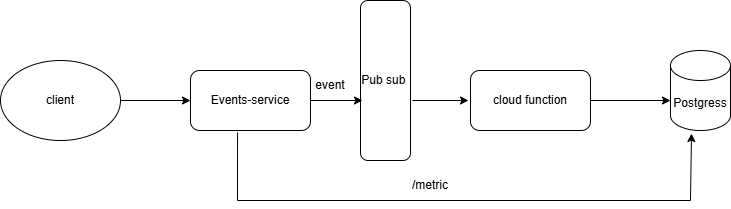

# 1. Architectural Mapping

| Component | Service | Key Capabilities |
| :--- | :--- | :--- |
| **db (Postgres 18)** | Cloud SQL for PostgreSQL | Automated backups, HA, and RLS support [1, 8]. |
| **events-service (API)** | Cloud Run | Scales to zero, handles HTTPS, and is perfect for Go [1]. |
| **ingestion-function (Ingestion)** | Cloud Functions | Event-driven processing for Pub/Sub messages [1]. |
| **pubsub** | Google Cloud Pub/Sub | Global, high-throughput message bus [1]. |

